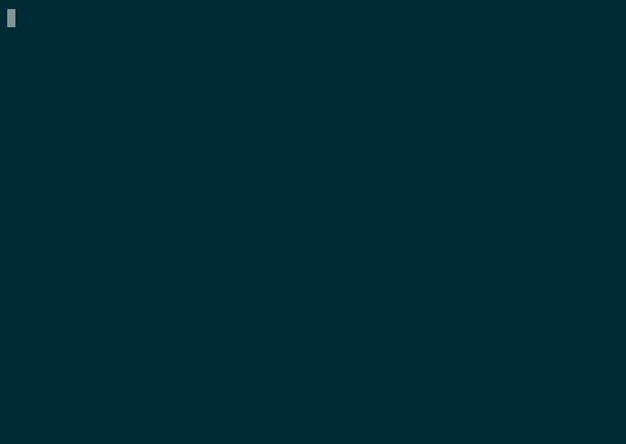

# Trelldo

Trello CLI

<p align="center">
  
</p>

## Installation

Build or download the trelldo binary to one of your bin paths. Trello
authentication requires an key and a token, get these on https://trello.com/app-key
and generate a token for your personal key.

Add these to the config YAML file.

```yaml
appkey: mykey
token: mytoken
```

This config file can be specified using the `--config` flag or simply put the
file at the default path `~/.trelldo.yaml`.

## Usage

The main trelldo commands follow a simple `trelldo verb noun --flags arg1 arg2 argN`.

```sh
trelldo (create|get|delete|archive|unarchive|action) (board|list|card) --board --list --card --help arg1 arg2
```

Not all the combinations of verb and noun are possible, to get specific details
use the help flag.

```sh
$ trelldo create --help
Create things

Usage:
  trelldo create [flags]
  trelldo create [command]

Available Commands:
  card        Create card
  list        Create list

Flags:
  -h, --help   help for create

Global Flags:
  -b, --board string    board name
  -c, --card string     card id
      --config string   config file (default is $HOME/.trelldo.yaml)
  -l, --list string     list name

Use "trelldo create [command] --help" for more information about a command.

$ trelldo create list --help
Create list

Usage:
  trelldo create list [name] [flags]

Flags:
  -h, --help   help for list

Global Flags:
  -b, --board string    board name
  -c, --card string     card id
      --config string   config file (default is $HOME/.trelldo.yaml)
  -l, --list string     list name
```

## Default context

Most trelldo commands that requires a board, list or card context can be
specified using the flags. If the flags are omitted, trelldo will look in the
config YAML file for the defaults.

```yaml
board: name
list: name
card: id
```

It is unlikely that `create (board|list|card)` should default to the config file
so both these require an argument with the name. The board and list is specified
by the name, whereas cards are specified by the id. This also means that any
command that operates on a card must already have recorded the card id in some
previous command.

However, any create command will set the default board, list or card to the new
one for subsequent commands. Also commands that change the state of a card will
use the default unless the head or tail flags are used. In this case the head or
tail card will be operated on and then set to the default.

## Use as a stack

In my .zshrc file there are two aliases and a function.

```sh
alias trhead="trelldo get card -b Work -l Stack --head 2>/dev/null"
alias trpop="trelldo delete card -b Work -l Stack --head 2>/dev/null"
trpush () { trelldo create card -b Work -l Stack --head "$*" 2>/dev/null }
```

As I work in the terminal, these allow me to quickly push cards (names only) to
the top of a todo list and pop them off when I want to perform them.

## Improvements

* Finish implementing all verbs
* Implement a human readable way to identify a card, maybe a numbered list from
  the get cards command.
* Maybe the delete command should set the card id to an existing card
